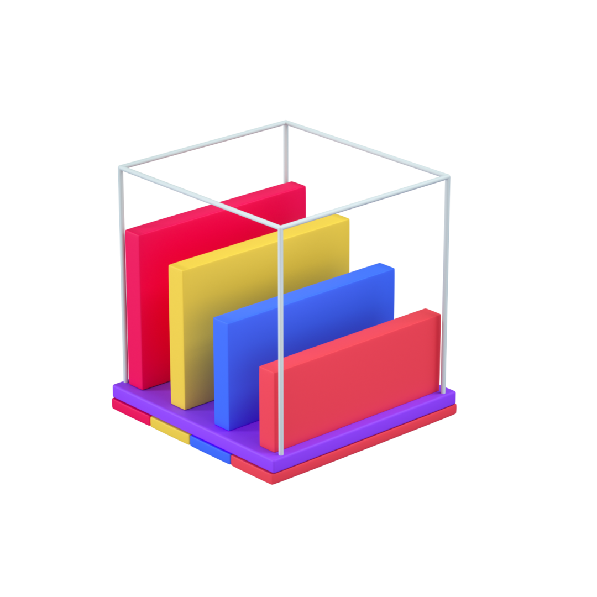

[![Contributors][contributors-shield]][contributors-url]
[![MIT License][license-shield]][license-url]
[![LinkedIn][linkedin-shield]][linkedin-url]
[![Website][website-shield]][website-url]


<!-- PROJECT LOGO -->
<br />
<p align="center">
 
 <a href="https://github.com/matiszz/Mastermind">
    
  </a>

  <h3 align="center">Mastermind</h3>

  <p align="center">
    The Mastermind game
  </p>
</p>


<!-- About the project -->
## 😎 About

[![Product Name Screen Shot][product-screenshot]](https://github.com/matiszz/Mastermind)

This is the famous mastermind game written in Java.

Its' settings allow the user to customize options, decide different play modes, and even play against an AI.

Feel free to try it! It's easy!


<!-- GETTING STARTED -->
## 👉🏽 Getting Started

### Prerequisites
Make sure to install
- [Java](https://www.java.com/es/download/)

### Installation

1. Clone the repo
```sh
git clone https://github.com/Mastermind.git
cd Mastermind/
```
2. Execute it
```sh
java -jar MasterMind.jar
```


<!-- LICENSE -->
## 📚 License

Distributed under the MIT License. See `LICENSE` for more information.


<!-- CONTACT -->
## 📞 Contact

Matias Szarfer - 🐤 [@matiasszarfer](https://twitter.com/matiasszarfer) · 📧 matias@szarfer.com · 💻 [matias.szarfer.com](https://matias.szarfer.com)

Project Link: [https://github.com/matiszz/Mastermind](https://github.com/matiszz/Mastermind)


<!-- MARKDOWN LINKS & IMAGES -->
<!-- https://www.markdownguide.org/basic-syntax/#reference-style-links -->
[contributors-shield]: https://img.shields.io/github/contributors/matiszz/Mastermind.svg?style=flat-square
[contributors-url]: https://github.com/matiszz/Mastermind/graphs/contributors

[license-shield]: https://img.shields.io/github/license/matiszz/Mastermind.svg?style=flat-square
[license-url]: https://github.com/matiszz/Mastermind/blob/master/LICENSE.txt

[linkedin-shield]: https://img.shields.io/badge/-LinkedIn-black.svg?style=flat-square&logo=linkedin&colorB=555
[linkedin-url]: https://linkedin.com/in/matias-szarfer

[website-shield]: https://img.shields.io/badge/-Website-black.svg?style=flat-square&colorB=555
[website-url]: https://matias.szarfer.com

[product-screenshot]: Documentation/screenshots/screenshot.png